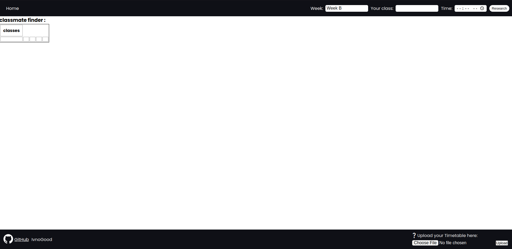

<h1 align="center">Class Organiser</h1>

<em>By: IvnoGood</em>

## Features

* Find classes
    * By day
    * By hour
    * By Week
* Upload your timetable to let your friends know when you finish (under devloppement) 
* Secured timetables by website password 🔐
* Know who have the same teatcher as you 👨‍🏫 (under devloppement)
* Get to see all the timetables reformated 🗓 (under devloppement)

## How to:

* First Select a day in the selector 📅
* Select a time ⌚
* Verify if the week is good ✔
* And then click research
    * If nothing shows up it's that there's no class ❌

## If u like the project give it a star ⭐

## Feel free to contribute to the code and to re-use the code for your own usage